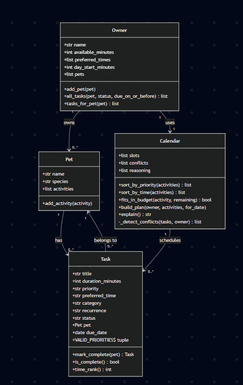

# PawPal+ (Module 2 Project)

You are building **PawPal+**, a Streamlit app that helps a pet owner plan care tasks for their pet.

## Scenario

A busy pet owner needs help staying consistent with pet care. They want an assistant that can:

- Track pet care tasks (walks, feeding, meds, enrichment, grooming, etc.)
- Consider constraints (time available, priority, owner preferences)
- Produce a daily plan and explain why it chose that plan

Your job is to design the system first (UML), then implement the logic in Python, then connect it to the Streamlit UI.

## What you will build

Your final app should:

- Let a user enter basic owner + pet info
- Let a user add/edit tasks (duration + priority at minimum)
- Generate a daily schedule/plan based on constraints and priorities
- Display the plan clearly (and ideally explain the reasoning)
- Include tests for the most important scheduling behaviors

## Getting started

### Setup

```bash
python -m venv .venv
source .venv/bin/activate  # Windows: .venv\Scripts\activate
pip install -r requirements.txt
```

### Suggested workflow

1. Read the scenario carefully and identify requirements and edge cases.
2. Draft a UML diagram (classes, attributes, methods, relationships).
3. Convert UML into Python class stubs (no logic yet).
4. Implement scheduling logic in small increments.
5. Add tests to verify key behaviors.
6. Connect your logic to the Streamlit UI in `app.py`.
7. Refine UML so it matches what you actually built.

## 🖥️ Sample Output

Paste a sample of your app's CLI or Streamlit output here so a reader can see what a generated plan looks like:

```
# e.g.:
# Daily plan for Biscuit (Golden Retriever):
#   08:00 — Morning walk (30 min) [priority: high]
#   09:00 — Feeding (10 min) [priority: high]
#   ...
SAMPLE OUTPUT
=============================================
Planning 5 task(s) for Purva within a 120-minute budget, highest priority first.
0:00-0:10: Feed Bruno (high priority, 10 min) — owner prefers morning
0:10-0:40: Morning walk (high priority, 30 min) — owner prefers morning
0:40-1:25: Vet appointment (high priority, 45 min) — owner prefers afternoon
1:25-1:35: Feed Whiskers (medium priority, 10 min) — owner prefers evening
1:35-1:55: Playtime (low priority, 20 min) — owner prefers evening
Scheduled 5 of 5 task(s); 5 of 120 minutes left unused.
=============================================
```
## 🧪 Testing PawPal+

```bash
# Run the full test suite:
pytest

# Run with coverage:
pytest --cov
```
# What is covered in each test:
1. test_mark_complete_updates_status:
A newly created task starts as "pending". After calling mark_complete(), it should flip to "complete" and is_complete() should return True.

2. test_adding_task_increases_pet_task_count:
A pet starts with zero activities. Each call to add_activity() should grow the list by one — it's checking that tasks are actually being stored.

3. test_add_activity_sets_pet_back_reference:
When a task is added to a pet, the task itself should know which pet it belongs to (via a task.pet back-reference). This ensures the link goes both ways.

4. test_all_tasks_filters_by_pet_and_status:
Checks two filtering methods on an owner with multiple pets. tasks_for_pet(dog) should return only that dog's tasks. all_tasks(status="pending") should exclude anything already completed.

test_plan_skips_completed_tasks:
5. When building a calendar plan, completed tasks shouldn't be scheduled or consume any time budget — only pending tasks should appear in the slots.

6. test_plan_orders_slots_by_time_of_day:
Even if tasks are added in random order (evening before morning), the calendar should sort them chronologically. It also checks that the first slot's start time matches the owner's day_start_minutes.

7. test_plan_detects_same_window_category_conflict:
Two tasks in the same time window and same category (e.g., both "feeding" in the morning) should be flagged as a conflict in calendar.conflicts.

8.test_future_recurring_occurrence_not_planned_today:
Completing a daily task creates tomorrow's occurrence. Since that new task is due tomorrow, today's calendar plan should be empty — and the reasoning log should mention it was deferred.

9. test_conflict_detected_even_when_task_cut_for_budget:
If two tasks clash but only one fits in the time budget, the second gets cut — but the conflict should still be flagged anyway. Cutting a task doesn't silently hide the scheduling problem.

10.test_invalid_recurrence_falls_back_to_none:
Unrecognized recurrence strings (like "hourly") should normalize to None rather than causing errors. Known values like "daily" should pass through unchanged.

11.test_sort_by_time_returns_chronological_order:
Feeds sort_by_time() a deliberately scrambled list — night, untimed, morning, afternoon, evening — and expects them back in strict chronological order: morning → afternoon → evening → night, with untimed tasks always last.

12.test_marking_daily_task_complete_creates_next_day_occurrence:
The core recurrence contract: completing a daily task should produce a new, distinct task that is pending, due exactly one day from today, and has the same title/duration/recurrence as the original. It should also be auto-registered on the pet.

13.test_scheduler_flags_tasks_sharing_a_time_window:
Two tasks in the same time window should always produce a non-empty calendar.conflicts list, and the conflict note should name the window (e.g., "morning"). This is the basic conflict-detection smoke test.

Sample test output:

```
# Paste your pytest output here
================================================== test session starts ==================================================
platform win32 -- Python 3.13.5, pytest-9.1.1, pluggy-1.6.0
rootdir: C:\Users\Purva\OneDrive\Desktop\Codepath\ai110-module2show-pawpal-starter
plugins: anyio-4.14.1
collected 13 items                                                                                                       

tests\test_pawpal.py .............                                                                                 [100%]

================================================== 13 passed in 0.59s ===================================================

Confidence Level: 5
```

## 📐 Smarter Scheduling

All scheduling logic lives in the `Calendar` class in `pawpal_system.py`; `Owner`, `Pet`, and `Task` are plain data holders.

| Feature | Method(s) | Notes |
|---------|-----------|-------|
| Priority-first budget selection | `sort_by_priority`, `fits_in_budget`, `build_plan` | Greedy fill by priority (`high → medium → low`, shorter-first tiebreak) while tasks fit `available_minutes`. |
| Sorting by time of day | `sort_by_time`, `time_rank` | Multi-key sort `(window, priority, duration)`; untimed tasks sort last. |
| Conflict warnings | `_detect_conflicts` | Flags same-category same-window collisions and over-stuffed preferred windows. |
| Daily / weekly recurrence | `Task.mark_complete` | Completing a recurring task auto-creates its next occurrence (tomorrow / +7 days). |
| Due-date deferral | `build_plan`, `all_tasks` | Future occurrences stay out of today's plan (`due_date <= for_date`). |
| Completed-task filtering | `build_plan`, `all_tasks` | Done tasks never consume budget or reappear. |
| Explainable reasoning | `reasoning`, `explain` | Every decision is recorded as a human-readable line. |

### Algorithms in detail

1. **Priority-first budget selection** — A greedy fill: tasks are sorted by priority (`high → medium → low`, with shorter duration as a tiebreak), then added one at a time while they fit the owner's remaining `available_minutes`. The most important tasks win scarce time; anything that doesn't fit is recorded in the reasoning log rather than dropped silently.

2. **Sorting by time of day** — A multi-key sort on `(time window, priority, duration)`. Windows order as `morning → afternoon → evening → night`; tasks with no `preferred_time` always sort last (`UNTIMED_RANK`). Selected tasks are then laid out **back-to-back** from the owner's `day_start_minutes`, so slots read as real clock times (e.g. `8:00–8:20`).

3. **Conflict warnings** — Tasks are grouped by `preferred_time` window, then flagged in two cases:
   - **Same-category collision** — two or more tasks of the same category in one window (e.g. two `feeding` tasks both set to `morning`).
   - **Preferred-window overload** — more than two tasks stacked into a window the owner explicitly prefers.

   Because `preferred_time` is a coarse window (not a clock time) and tasks are placed back-to-back, this detects *window contention* rather than minute-level overlap. Conflicts are computed over **all** due-today tasks — including ones cut for budget — so a real clash isn't hidden by trimming.

4. **Daily / weekly recurrence** — Completing a recurring task auto-generates its next occurrence: `daily` → due tomorrow, `weekly` → due in seven days. The new task copies the original's title, duration, priority, time, and category, starts `pending`, and (if a pet is passed) attaches itself to that pet automatically. One-off tasks return `None`.

5. **Due-date deferral** — Only tasks `due_date <= for_date` (default today) are planned, so a freshly created tomorrow occurrence stays out of today's plan. Deferred counts are surfaced in the reasoning.

6. **Completed-task filtering** — Done tasks never consume budget or reappear in the plan; `all_tasks(status=...)` also supports pending/complete views.

7. **Explainable reasoning log** — Every decision — budget check, each scheduled slot, skips, deferrals, conflicts — is recorded as a human-readable line, surfaced in both the CLI and the UI.

## 📸 Demo Walkthrough

### CLI demo — `main.py`

Run `python main.py`. It builds owner **Purva** (120 min, prefers morning/evening) with two pets, **Bruno** (dog) and **Whiskers** (cat), and adds seven tasks **deliberately out of order** to exercise the algorithms:

1. **Sort by time** — prints all tasks reordered `morning → afternoon → evening → night`, with the untimed *Playtime* last, proving the chronological sort.
2. **Pending filter** — lists only not-yet-done tasks.
3. **Completed filter** — lists *Morning walk*, which was marked done during setup.
4. **Filter by pet** — shows only Bruno's tasks with status.
5. **Recurrence** — marks daily *Feed Bruno* complete and prints the auto-created next occurrence due **tomorrow**.
6. **Full schedule + conflicts** — runs `build_plan` and prints `explain()`. The two `afternoon`/`medical` tasks (*Vet appointment* + *Grooming*) trigger a **conflict warning**.

### Interactive demo — `app.py` (Streamlit)

Run `streamlit run app.py`.

1. **Owner & Pet** — set name, available minutes, pet, species, and day-start hour (which anchors slot clock times).
2. **Add tasks** — a form captures title, duration, category, priority, preferred time, and repeat (none/daily/weekly). Tasks persist in `session_state`.
3. **Task list** — shows each task; **Mark done** completes it and, for daily/weekly tasks, queues the next occurrence as *upcoming* (`in 1d` / `in 7d`) — the UI mirror of `Task.mark_complete`.
4. **Generate schedule** — builds the plan from tasks due today and renders, in order:
   - **Conflict warnings first** — each window clash in its own expander with a remediation tip.
   - **Metrics + schedule table** — tasks scheduled, minutes used/remaining, and the plan sorted by time of day.
   - **Tasks cut for budget** — anything skipped, with a tip to add time.
   - **"Why this plan"** — the full color-coded reasoning log.

**Screenshot or video** *(optional)*: <!-- Insert a screenshot or link to a demo video here -->
